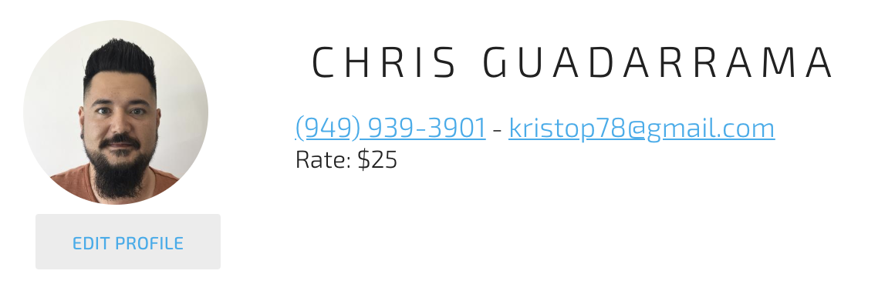

# Vue Assessment

The goal of this assessment is to get a understanding of your front-end skills. 

* There is no pass or fail.
* No time limit.
* Using the internet is encouraged.
* Asking questions is also encouraged.

## Getting Started

Follow the instructions below to get started (downloading, installing packages and running the project)

* clone this repository (alternatively forking this project is also an option)
  * git clone https://github.com/vin-e/vue-assessment
* change the directory to the vue-assessment folder
  * cd vue-assessment
* install node packages
  * npm i
* serve this project
  * npm run serve

## Finishing the assessment

To finish the project please push to a repository on your github account.

## The actual assessment

### The task

Recreating the user profile header in vue as a new component.

* Create a new file in /src/components folder for a user profile
* Replace the <HelloWorld> component in the Home.vue file with the new component you just created
* Back in the component I would like to see SCSS used in the component to build the user component.
* All client profile information should be properties passed into the vue component that can be changed.
* If no image url is passed in then the edit profile should be under the Rate information. And there should be no image circle.

Notes:

* The image to use can be found in /scc/assets/chris.jpg
* Use the following font https://fonts.googleapis.com/css?family=Exo+2:400,100,200,300,700,500,600,800,100italic,200italic,300italic,400italic,500italic,600italic,700italic,800italic
* If you want to use a UI framework then I would suggest vuetify but this is not necessary.
* The spacing and font sizes are not important to match 100%. Getting close is great.
* Some things are intentionally left vague to encourage you to look things up and/or ask questions.